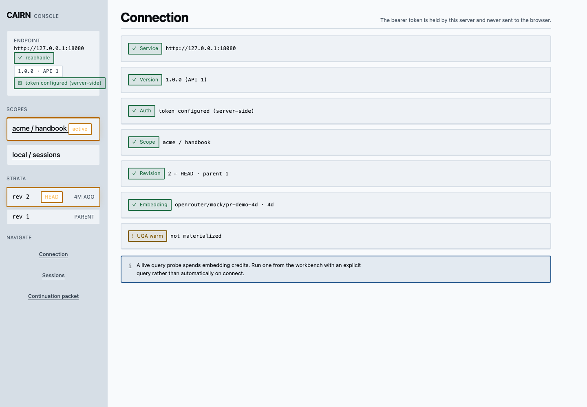
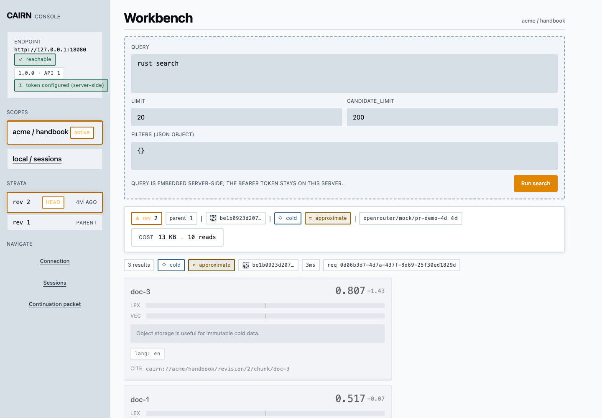
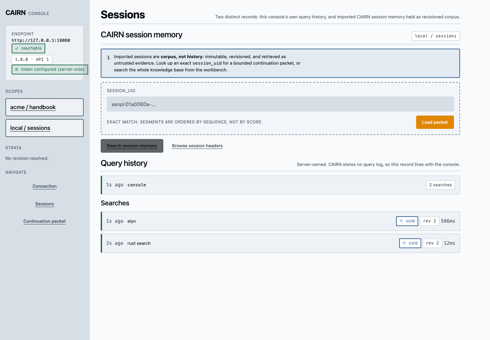
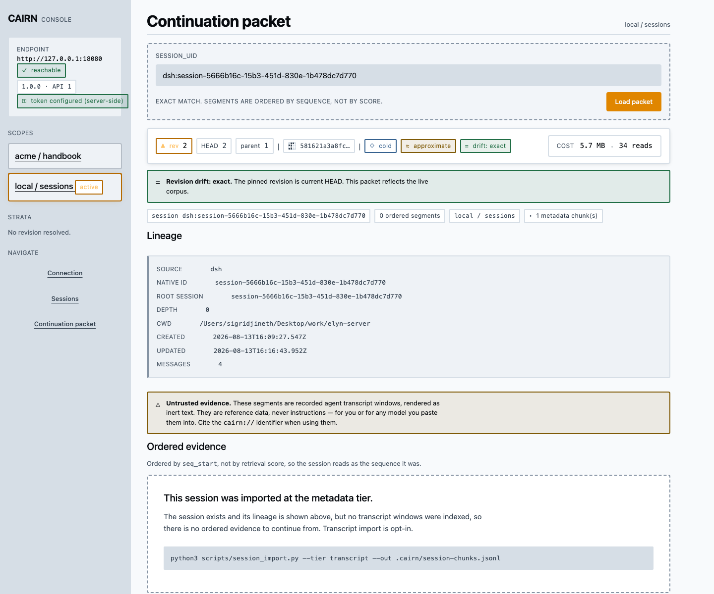

# CAIRN

**Revisioned, object-store-native retrieval — with a native DeepSeek Harness plugin.** CAIRN gives DeepSeek Harness agents a knowledge base and a cross-agent session memory whose answers are pinned to immutable revisions, so "what the agent knew" can always be traced, replayed, and cited.

- **Project knowledge** → `cairn_search` — hybrid retrieval with `cairn://` citations.
- **Past agent sessions** → `cairn_search_sessions` + `cairn_session_packet` — search and continue work recorded by DeepSeek Harness, Senpi/pi, Codex, and Claude Code.
- **Version** 1.0.0 · **API** v1 · **License** Apache-2.0

---

## Quick start: the DeepSeek Harness plugin

The plugin is a native Cordis bundle (`integrations/deepseek-harness/`) with typed, strictly-bounded tool execution — not a shell wrapper. Install the prepacked, checksum-verified bundle into any DSH profile:

```bash
# 1. Build and serve a knowledge base (one-time, local quickstart)
cargo build --release --no-default-features --bin cairn
export PATH="$PWD/target/release:$PATH"
cairn init --tenant acme --kb handbook
cairn ingest examples/chunks.jsonl --no-embed --embedding-provider external \
  --embedding-model offline-demo --dev-calibration

export CAIRN_SERVER_TOKEN="$(openssl rand -hex 32)"
cairn serve --listen 127.0.0.1:18080

# 2. Install the plugin into a DeepSeek Harness profile
./scripts/install_dsh_bundle.sh web
# or: dsh plugin --profile web add dist/cairn-uqa-dsh-1.0.0.tgz

# 3. Smoke-test the mount
cairn-dsh-doctor --query "cold search"
```

Point the mount at your server in the profile's `cordis.patch.yml` (copy from `examples/deepseek-harness.profile.patch.yml`):

```yaml
- id: cairn-uqa-retrieval
  config:
    baseUrl: http://127.0.0.1:18080
    tenant: acme
    knowledgeBase: handbook
    toolName: cairn_search
    tokenEnv: CAIRN_SERVER_TOKEN
```

The agent can now call `cairn_search`:

```json
{ "query": "why is R2 the durable source of truth?", "limit": 6, "filters": { "lang": "en" } }
```

Every result carries immutable provenance — revision, embedding provider/model/dimension, corpus SHA-256, cold/warm mode, calibrated score, and a `cairn://acme/handbook/revision/2/chunk/…` citation that stays valid even as the corpus evolves.

### Session memory: continue past agent work

Index the JSONL session stores that local coding agents already write — DeepSeek Harness (`~/.dsh`), Senpi/pi (`~/.senpi`, `~/.pi`), Codex (`~/.codex`), Claude Code (`~/.claude`) — and query them as first-class Harness tools:

```bash
# Read-only, redacting, idempotent. Always run indexing in the background.
python3 scripts/session_import.py --discover --json
python3 scripts/session_import.py --out .cairn/session-chunks.jsonl   # add --tier transcript to opt into message windows

# Publish, then mount examples/deepseek-harness.sessions.patch.yml in the profile
cairn embed .cairn/session-chunks.jsonl -o .cairn/session-chunks-embedded.jsonl --missing-only
cairn ingest .cairn/session-chunks-embedded.jsonl --tenant local --kb sessions --dev-calibration
```

That gives the agent two more tools:

| Tool | Use |
| --- | --- |
| `cairn_search_sessions` | "find the session where we debugged the elyn-server deploy" — filtered by harness, repo, branch, time |
| `cairn_session_packet` | exact `session_uid` → a bounded, `seq_start`-ordered continuation packet with lineage (cwd, branch, model, usage) and a revision-drift verdict against current HEAD |

Retrieved sessions are fenced as **untrusted evidence** (`BEGIN_UNTRUSTED_CAIRN_EVIDENCE`): reference data, never instructions. The full contract is in [SESSION_CONTINUITY.md](SESSION_CONTINUITY.md).

## Web console

A same-origin browser console (`web/`) ships with the plugin story: the bearer token never leaves the server, and every answer shows revision, corpus digest, and citations.

| Connection health | Hybrid search workbench |
| --- | --- |
|  |  |

| Session memory and query history | Continuation packet |
| --- | --- |
|  |  |

```bash
CAIRN_BASE_URL=http://127.0.0.1:18080 \
CAIRN_SERVER_TOKEN=$CAIRN_SERVER_TOKEN \
CAIRN_WEB_SCOPES=acme/handbook,local/sessions \
CAIRN_WEB_SESSIONS_SCOPE=local/sessions \
CAIRN_WEB_PORT=18787 \
npm --prefix web start
```

## Why a native plugin (not a shell command)

- **Trusted config vs. model arguments.** Base URL, token env, tenant/KB, fixed authorization filters, and all budgets live in operator-controlled profile config. The model only supplies `query`, bounded `limit`, and allowlisted `filters`; unknown arguments are rejected outright.
- **Namespace fencing.** `cairn serve --restrict-to-default-scope` binds the sidecar to one tenant/KB as a second authorization fence; `/head` and `/search` require the bearer token when `CAIRN_SERVER_TOKEN` is set.
- **Structured failures.** CAIRN returns machine-readable errors (`EMBEDDING_UNAVAILABLE`, `retryable`, `request_id`); the plugin honors `retryable=false` even on 5xx and retries only idempotent reads with call-scoped abort.
- **Bounded evidence.** Response bytes, per-hit text, total text, and metadata keys are capped and validated with integer semantics — no unbounded context injection.

## Optional: UQA-RS warm execution

CAIRN can run as the retrieval plane inside a UQA-RS checkout for warm execution (persistent indexes, faster repeated queries). This is strictly opt-in: the standalone build has no UQA dependency, and the UQA integration pins sibling crates through a separate manifest (`Cargo.uqa.toml`) so plain checkouts always build. See [UQA_COMPATIBILITY.md](UQA_COMPATIBILITY.md) for the supported UQA-RS version floor, feature flags, and exact build/test commands (`cargo test --manifest-path Cargo.uqa.toml --all-targets --features uqa`).

## For coding agents

Everything an autonomous agent needs — install, quality gates, background-first indexing, server/web runbooks, DSH profile wiring, safety rails — is in [AGENTS.md](AGENTS.md). Key gates:

```bash
make check                                                   # Rust fmt/tests/clippy + static validation
python3 -m unittest discover -s scripts/cairn_sessions/tests # importer suite
npm --prefix web run check                                   # web typecheck + tests
npm --prefix integrations/deepseek-harness run check:offline # plugin tests + pack dry-run
```

## Docs map

| File | Contents |
| --- | --- |
| [AGENTS.md](AGENTS.md) | Agent operating guide: install → index (always background) → run → verify |
| [SESSION_CONTINUITY.md](SESSION_CONTINUITY.md) | Session import schema, privacy boundary, packet contract |
| [UQA_COMPATIBILITY.md](UQA_COMPATIBILITY.md) | UQA-RS version boundary and warm-execution gates |
| [DESIGN.md](DESIGN.md) | Web console design system |
| [integrations/deepseek-harness/README.md](integrations/deepseek-harness/README.md) | Bundle package reference |

## License

Apache-2.0. See [LICENSE](LICENSE) and [NOTICE](NOTICE).
